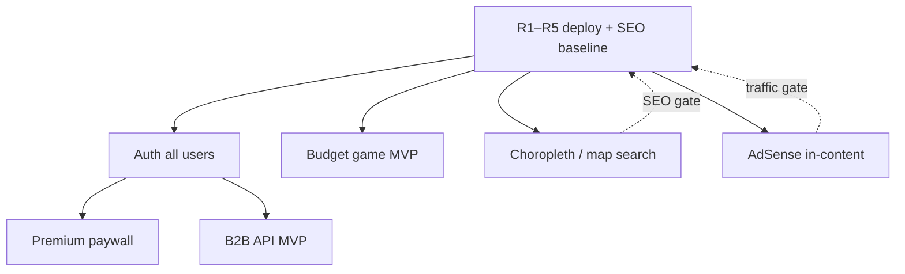

# Triplandr — Future Features Roadmap

Планы следующей волны развития (после growth backlog EPIC 0–3). Не коммитить secrets; реализация — после стабилизации build wave R1–R5.

## Документы

| Приоритет | Документ | Статус | Gate / условие старта |
|-----------|----------|--------|------------------------|
| P0 | [auth-all-users.md](./auth-all-users.md) | Ready | После R1–R5 deploy; ~3 нед MVP |
| P1 | [premium-paywall-reviews.md](./premium-paywall-reviews.md) | Ready | Требует Auth (Phase 1) |
| P1 | [budget-game.md](./budget-game.md) | Ready | Анонимный MVP; Auth v2 для leaderboard |
| P2 | [choropleth-map-search-deferred.md](./choropleth-map-search-deferred.md) | **DEFER** | ≥5k organic/mo, compare indexed ≥90% |
| P3 | [adsense-hero-deferred.md](./adsense-hero-deferred.md) | **DEFER** | ≥50k sessions/mo, CMP, affiliate baseline |
| P3 | [b2b-api.md](./b2b-api.md) | Ready (MVP spec) | Auth + ≥40 стран с 5+ отзывами |

## Зависимости

## Рекомендуемая очередность

1. **Deploy build wave** (R1→R5) — compare SEO, hubs, leads, smoke CI
2. **Auth Phase 0–1** — profiles, magic link + Google, review ownership
3. **Budget game MVP** — параллельно с Auth v2; анонимный funnel, affiliate slot `budget`
4. **Premium paywall Phase 1** — после Auth; freemium 3 reviews + soft blur
5. **Дешёвые map wins** — поиск в списке, клики по карте (из choropleth doc, до gate)
6. **B2B API read-only** — после Auth + достаточной плотности отзывов
7. **Choropleth full** — только после SEO gate (2+ мес метрик)
8. **AdSense** — in-content/sidebar, не hero; после traffic gate

## Cross-links

- Monetization transparency: `/about/monetization`, [media-kit-v0.md](../media-kit-v0.md)
- Affiliate A/B: [affiliate-ab-testing.md](../affiliate-ab-testing.md)
- GSC/KPI: [gsc-ctr-optimization.md](../gsc-ctr-optimization.md), [kpi-retro-template.md](../kpi-retro-template.md)
- Post-launch ops: [post-launch-checklist.md](../post-launch-checklist.md)

## Не делать рано

- Mass AdSense в hero — бьёт по finder UX и trust positioning
- MapLibre rewrite — SVG incremental достаточен до gate
- B2B leads API — до DPA и explicit consent (Phase 3 в b2b-api.md)
- Premium без SEO-safe SSR — риск cloaking
