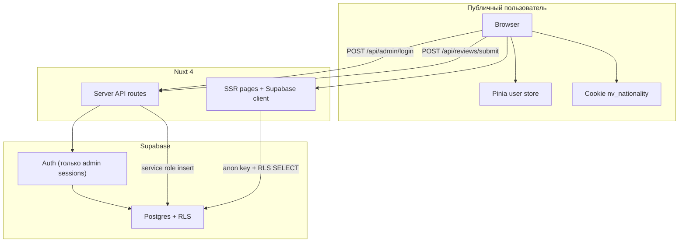
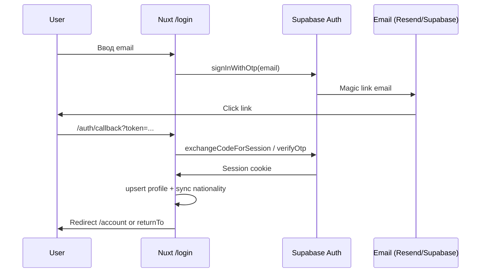
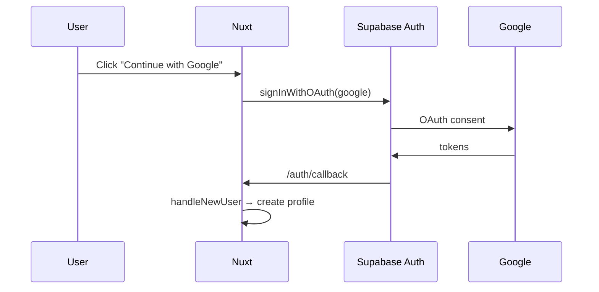
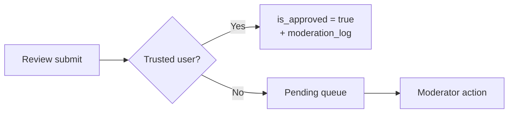
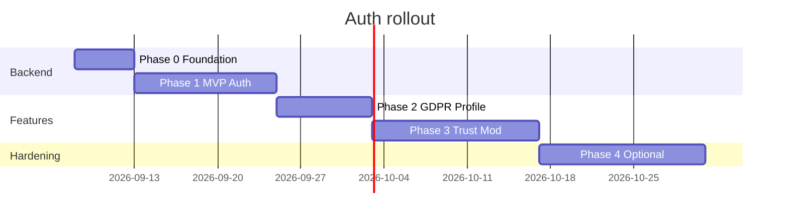

# Auth for all users — продуктово-технический roadmap

**Проект:** Triplandr (`/Users/ievgen_no/maks_projects/countries`)  
**Стек:** Nuxt 4, Supabase (Postgres + Auth), i18n (uk/en/ru), Pinia, server routes с service role  
**Дата:** 2026-09-01  
**Статус:** Draft — планирование, без реализации  
**Связанные документы:** [`docs/admin-setup.md`](../admin-setup.md), [`docs/moderation-sla.md`](../moderation-sla.md)

---

## 0. Executive summary (для команды)

Triplandr сегодня — **анонимная платформа**: читатели выбирают национальность через cookie `nv_nationality`, отзывы отправляются через server proxy (`POST /api/reviews/submit`) без привязки к пользователю. Единственная auth-сессия — **админка** (`admin_users` + email/password + `requireAdmin`).

Цель roadmap — ввести **опциональную, затем рекомендуемую** регистрацию для всех пользователей, сохранив анонимность публикации отзывов, и получить:

- единый профиль (национальность, locale, избранное);
- ownership отзывов (редактирование, удаление, «мои отзывы»);
- per-user rate limits и trust signals для модерации;
- фундамент для premium paywall и B2B API.

**Рекомендуемый MVP:** Email magic link (passwordless) + Google OAuth. Apple — Phase 2. Анонимный submit остаётся, но с мягким nudge к регистрации.

---

## 1. Текущее состояние (as-is)

### 1.1. Что уже есть

| Компонент | Реализация | Файлы |
|-----------|------------|-------|
| Supabase Auth | Подключён через `@nuxtjs/supabase`, `redirect: false` | `nuxt.config.ts` |
| Admin login | Email + password → `signInWithPassword`, проверка `admin_users` | `server/api/admin/login.post.ts`, `app/pages/admin/login.vue` |
| Admin guard | Session check + `requireAdmin()` на API | `app/middleware/admin-auth.ts`, `server/utils/requireAdmin.ts` |
| Public reviews | Insert через **service role** (обходит RLS) | `server/api/reviews/submit.post.ts` |
| RLS reviews | SELECT approved; INSERT `with check (true)` | `supabase/migrations/008_rls.sql` |
| Nationality | Cookie `nv_nationality` + localStorage + Pinia | `app/stores/user.ts`, `app/plugins/nationality-init.ts` |
| Rate limit | IP-only: 5 submits/hour, 10 admin logins/15min | `server/utils/reviewRateLimit.ts`, `requireAdmin.ts` |
| Favorites | localStorage `nv_favorites` | `app/stores/user.ts` |
| Privacy copy | «Регистрация не требуется» | `app/locales/*/pages.ts` → `privacy` |

### 1.2. Схема reviews (релевантные поля)

```sql
reviews (
  id uuid PK,
  author_nationality text NOT NULL,  -- ISO alpha-2, не FK
  target_country text NOT NULL,
  ratings jsonb, comments jsonb,
  is_approved boolean DEFAULT false,
  author_profile text NULL,          -- 'seed' для демо
  moderated_at, moderated_by,
  -- user_id ОТСУТСТВУЕТ
)
```

### 1.3. Admin schema

```sql
admin_users (
  id uuid PK REFERENCES auth.users(id) ON DELETE CASCADE,
  email text UNIQUE,
  role text CHECK (role IN ('moderator','editor','superadmin'))
)
```

RLS на `admin_users`: `using (false)` — доступ только через service role.

### 1.4. Архитектурная диаграмма (as-is)



### 1.5. Ключевые ограничения as-is

1. **Нет `user_id` на reviews** — невозможно «мои отзывы», edit/delete владельцем, per-user trust.
2. **Два источника nationality** — cookie/localStorage vs (будущий) profile; риск рассинхрона.
3. **Service role на submit** — обходит RLS; при переходе на user-scoped insert нужна новая политика.
4. **In-memory rate limits** — не переживают cold start Vercel, не работают multi-instance без Redis.
5. **Privacy policy устареет** — явно заявлено отсутствие регистрации.

---

## 2. Цели и KPI

### 2.1. Продуктовые цели

| # | Цель | Измерение |
|---|------|-----------|
| G1 | Снизить friction повторных визитов (избранное, nationality sync) | D7 return rate |
| G2 | Дать авторам контроль над своими отзывами | % отзывов с `user_id` |
| G3 | Улучшить качество модерации через trust signals | Pending queue time, rejection rate |
| G4 | Подготовить identity layer для monetization | Auth MAU |
| G5 | Сохранить анонимность публикации | 0 публичных PII в UI отзывов |

### 2.2. Нефункциональные цели

- **Безопасность:** RLS-first, минимум service role на user paths
- **GDPR:** export + delete account ≤ 30 дней SLA
- **i18n:** auth UI на uk/en/ru
- **SSR:** nationality и session согласованы на первом рендере
- **Backward compat:** анонимный submit не ломается в Phase 0–1

---

## 3. User stories

### 3.1. Читатель (Reader)

| ID | Story | Acceptance criteria | Phase |
|----|-------|---------------------|-------|
| R-01 | Как читатель, хочу сохранить национальность между устройствами | После login nationality берётся из `profiles.default_nationality`; cookie синхронизируется | MVP |
| R-02 | Как читатель, хочу синхронизировать избранные страны | Favorites в `user_favorites` + merge при первом login | MVP |
| R-03 | Как читатель, хочу войти без пароля | Magic link за ≤ 60 сек; fallback «отправить снова» | MVP |
| R-04 | Как читатель, хочу войти через Google | OAuth one-click; email verified автоматически | MVP |
| R-05 | Как читатель, хочу оставаться анонимным | Можно пользоваться сайтом без login; отзывы без имени | Always |
| R-06 | Как читатель, хочу сменить locale в профиле | `profiles.locale` override cookie `nv_locale` | Phase 2 |
| R-07 | Как читатель, хочу удалить аккаунт | Self-service delete; отзывы anonymize или delete по выбору | Phase 2 |

### 3.2. Автор отзыва (Reviewer)

| ID | Story | Acceptance criteria | Phase |
|----|-------|---------------------|-------|
| V-01 | Как автор, хочу видеть статус своих отзывов | `/account/reviews` — pending/approved/rejected | MVP |
| V-02 | Как автор, хочу редактировать отзыв до approve | PATCH own review if `is_approved = false` | MVP |
| V-03 | Как автор, хочу редактировать после approve в grace window | 72h window, re-moderation | Phase 2 |
| V-04 | Как автор, хочу удалить свой отзыв | Soft delete → hide from public; stats recalc | MVP |
| V-05 | Как автор без аккаунта, хочу оставить отзыв | Anonymous submit сохраняется; post-submit CTA «привязать к аккаунту» | MVP |
| V-06 | Как автор, хочу получить verified badge | ≥2 approved reviews + email verified + account age 30d | Phase 3 |
| V-07 | Как автор, хочу не менять nationality без подтверждения | Смена `default_nationality` → confirm modal; старые отзывы сохраняют `author_nationality` | MVP |

### 3.3. Модератор (Moderator)

| ID | Story | Acceptance criteria | Phase |
|----|-------|---------------------|-------|
| M-01 | Как модератор, хочу видеть user_id автора | Admin review detail: linked user, trust score | MVP |
| M-02 | Как модератор, хочу видеть историю нарушений пользователя | `user_moderation_flags` count | Phase 2 |
| M-03 | Как модератор, хочу auto-approve trusted users | Rule: verified + 3+ approved → skip queue | Phase 3 |
| M-04 | Как модератор, хочу банить user, не только IP | `profiles.is_banned` blocks submit | Phase 2 |
| M-05 | Как модератор, хочу различать seed и real | Без изменений (`author_profile = 'seed'`) | Always |

### 3.4. Админ / Editor (существующий)

| ID | Story | Acceptance criteria | Phase |
|----|-------|---------------------|-------|
| A-01 | Admin login остаётся отдельным | `/admin/login` + `admin_users` check; не смешивать с `/login` | Always |
| A-02 | Один auth.users может быть admin и reviewer | `admin_users.id` FK сохраняется; public profile отдельно | MVP |

---

## 4. Методы аутентификации — рекомендации

### 4.1. Сравнительная таблица

| Метод | UX | Конверсия | Безопасность | Effort | Рекомендация |
|-------|-----|-----------|--------------|--------|--------------|
| **Email magic link** | Отличный (no password) | Высокая | Medium (email takeover) | S | **MVP** |
| **Google OAuth** | Отличный | Очень высокая | High | S | **MVP** |
| **Apple Sign In** | Хороший (iOS) | Средняя на web | High | M | **Phase 2** |
| Email + password | Средний | Низкая | Medium (reuse, leaks) | S | **Не делать** для public |
| Phone OTP | Хороший в UA | Средняя | Medium | L | Backlog |
| Passkeys/WebAuthn | Отличный | Низкая adoption | Very high | L | Phase 4+ |

### 4.2. MVP (Phase 1): Magic link + Google

**Почему magic link, а не password:**
- Согласуется с privacy positioning («минимум данных»)
- Меньше support burden (reset password)
- Supabase native: `signInWithOtp({ email })`

**Почему Google в MVP:**
- Целевая аудитория expat — высокая доля Google accounts
- Email pre-verified → сразу trust signal
- Supabase Dashboard: enable Google provider, 1 redirect URI

**Почему Apple не в MVP:**
- Apple Developer Program ($99/год), Service ID, domain verification
- На desktop web конверсия ниже; ROI после базовой auth

### 4.3. Phase 2: Apple Sign In

- Требование App Store при будущем native app
- Supabase: Apple provider + `client secret` rotation (JWT, 6 months)
- Hide email relay: хранить `auth.users.email` как private relay; не показывать публично

### 4.4. Flow diagrams

**Magic link (MVP):**



**Google OAuth (MVP):**



### 4.5. Supabase Auth config (MVP checklist)

- [ ] Site URL: `https://triplandr.com`
- [ ] Redirect URLs: `https://triplandr.com/auth/callback`, `http://localhost:3000/auth/callback`
- [ ] Email templates: uk/en/ru (custom via Supabase or Resend SMTP)
- [ ] `enable_confirmations`: **true** для magic link (email verified)
- [ ] JWT expiry: 3600s access, refresh rotation enabled
- [ ] `nuxt.config.ts`: добавить public routes в `redirectOptions.exclude`

---

## 5. Схема user profile

### 5.1. Таблица `profiles`

```sql
-- Migration: 019_user_profiles.sql

create table if not exists profiles (
  id uuid primary key references auth.users(id) on delete cascade,
  created_at timestamptz not null default now(),
  updated_at timestamptz not null default now(),

  -- Identity (private — never exposed in review UI)
  display_name text,                    -- optional, internal/admin only
  avatar_url text,                      -- Supabase Storage or OAuth avatar

  -- Preferences
  default_nationality char(2),          -- ISO 3166-1 alpha-2, uppercase
  locale text check (locale in ('uk','en','ru')),

  -- Trust & moderation
  email_verified_at timestamptz,        -- synced from auth.users on login
  is_verified_reviewer boolean not null default false,
  verified_reviewer_at timestamptz,
  trust_score smallint not null default 0,  -- 0–100, computed
  is_banned boolean not null default false,
  banned_at timestamptz,
  ban_reason text,

  -- GDPR
  deletion_requested_at timestamptz,
  anonymized_at timestamptz,

  -- Analytics
  signup_source text,                   -- 'magic_link' | 'google' | 'apple' | 'review_cta'
  last_seen_at timestamptz
);

create index idx_profiles_nationality on profiles (default_nationality);
create index idx_profiles_verified on profiles (is_verified_reviewer) where is_verified_reviewer = true;
```

### 5.2. Таблица `user_favorites`

```sql
create table if not exists user_favorites (
  user_id uuid references profiles(id) on delete cascade,
  country_code char(2) not null,
  created_at timestamptz not null default now(),
  primary key (user_id, country_code)
);
```

### 5.3. Расширение `reviews`

```sql
alter table reviews
  add column if not exists user_id uuid references profiles(id) on delete set null,
  add column if not exists edit_count smallint not null default 0,
  add column if not exists last_edited_at timestamptz,
  add column if not exists deleted_at timestamptz;  -- soft delete

create index idx_reviews_user_id on reviews (user_id) where user_id is not null;
create index idx_reviews_user_pending on reviews (user_id, created_at desc)
  where is_approved = false and deleted_at is null;
```

**Важно:** `author_nationality` остаётся на review row — это **snapshot** на момент публикации, не live join на profile. Фильтрация стран по nationality не ломается.

### 5.4. Verified reviewer badge — правила

| Критерий | Вес | Примечание |
|----------|-----|------------|
| Email verified | Required | `auth.users.email_confirmed_at` |
| ≥ 2 approved reviews | Required | Distinct `target_country` preferred |
| Account age ≥ 30 days | Required | Anti-sybil |
| 0 rejections in last 90 days | Required | |
| Moderator manual override | Optional | Admin can grant/revoke |

**UI:** Badge «Verified reviewer» — **не** раскрывает имя/email. Только иконка на ReviewCard для отзывов с `is_verified_reviewer = true` на момент submit (denormalize `author_was_verified boolean` на review для исторической точности).

### 5.5. Avatar

- MVP: OAuth avatar URL (Google) или initials placeholder
- Phase 2: Supabase Storage bucket `avatars/{user_id}` with RLS
- **Never** show avatar on public review cards (анонимность)

### 5.6. Trigger: auto-create profile on signup

```sql
create or replace function public.handle_new_user()
returns trigger language plpgsql security definer set search_path = public as $$
begin
  insert into public.profiles (id, email_verified_at, signup_source)
  values (
    new.id,
    new.email_confirmed_at,
    coalesce(new.raw_app_meta_data->>'provider', 'email')
  );
  return new;
end;
$$;

create trigger on_auth_user_created
  after insert on auth.users
  for each row execute function public.handle_new_user();
```

---

## 6. Review ownership

### 6.1. Правила edit/delete

| Состояние review | Owner (logged in) | Anonymous | Moderator |
|------------------|-------------------|-----------|-----------|
| Pending (`is_approved=false`) | Edit + Delete | — (no ownership) | Edit + Approve/Reject/Delete |
| Approved, < 72h | Edit → re-queue pending | — | Edit + Delete |
| Approved, > 72h | Request edit (Phase 3) | — | Edit + Delete |
| Rejected | Delete only | — | Delete |
| Soft deleted | — | — | Permanent delete (superadmin) |

### 6.2. Anonymous → authenticated migration

**Сценарий A: Post-submit CTA (MVP)**

1. Anonymous submit → response `{ ok: true, id, claim_token }`
2. `claim_token` = HMAC-SHA256(review_id + secret), TTL 7 days, httpOnly cookie `nv_review_claim`
3. После signup/login: `POST /api/reviews/claim` with token → set `user_id`
4. Token one-time use

**Сценарий B: Email match (Phase 2)**

- Если при submit указан email (optional field) → send «claim your review» link
- Not in MVP (добавляет PII к форме)

**Сценарий C: Bulk orphan (one-time migration)**

- Existing reviews: `user_id = NULL` forever
- No retroactive claim without proof

### 6.3. API endpoints (new)

| Method | Path | Auth | Description |
|--------|------|------|-------------|
| POST | `/api/reviews/submit` | Optional session | If session: attach `user_id`; else anonymous |
| POST | `/api/reviews/claim` | Required | Claim by token |
| GET | `/api/account/reviews` | Required | List own reviews |
| PATCH | `/api/account/reviews/[id]` | Required + owner | Edit pending/ grace |
| DELETE | `/api/account/reviews/[id]` | Required + owner | Soft delete |
| GET | `/api/account/profile` | Required | Profile + favorites |
| PATCH | `/api/account/profile` | Required | Update nationality, locale |
| POST | `/api/account/delete` | Required | GDPR delete request |

### 6.4. RLS policies для reviews (target state)

```sql
-- SELECT: public approved, non-deleted
create policy reviews_select_approved on reviews
  for select using (
    is_approved = true and deleted_at is null
  );

-- SELECT: owner sees own (any status)
create policy reviews_select_own on reviews
  for select using (
    auth.uid() = user_id
  );

-- INSERT: authenticated users
create policy reviews_insert_authenticated on reviews
  for insert with check (
    auth.uid() = user_id
    and not exists (
      select 1 from profiles where id = auth.uid() and is_banned = true
    )
  );

-- INSERT: anonymous (via server only — service role OR dedicated anon policy)
-- Option A (recommended): keep server proxy, attach user_id if session present
-- Option B: anon policy with strict column check — harder to secure

-- UPDATE: owner, pending only
create policy reviews_update_own_pending on reviews
  for update using (
    auth.uid() = user_id
    and is_approved = false
    and deleted_at is null
  );

-- DELETE (soft): owner
create policy reviews_soft_delete_own on reviews
  for update using (auth.uid() = user_id)
  with check (deleted_at is not null);
```

**Рекомендация:** сохранить server proxy для submit в MVP, но передавать session user_id когда есть. Переход на pure RLS insert — Phase 2 после аудита.

---

## 7. Session vs cookie nationality — single source of truth

### 7.1. Проблема

Сейчас nationality живёт в **трёх местах**:

1. Cookie `nv_nationality` (SSR, 1 year)
2. localStorage `nationality` (client fallback)
3. Pinia `userStore.nationality` (runtime)

После auth добавится **четвёртый** — `profiles.default_nationality`.

### 7.2. Целевая модель приоритетов

```
┌─────────────────────────────────────────────────────────┐
│ Effective nationality (computed getter)                 │
├─────────────────────────────────────────────────────────┤
│ 1. Guest override cookie (session-only, optional)       │  ← «Посмотреть как CN» без смены профиля
│ 2. profiles.default_nationality (if logged in)          │  ← source of truth для logged-in
│ 3. Cookie nv_nationality (guest)                        │
│ 4. null → show nationality picker                       │
└─────────────────────────────────────────────────────────┘
```

### 7.3. Рефакторинг `useUserStore`

```typescript
// Target: app/stores/user.ts (conceptual)

state: {
  nationality: '',           // effective (computed or synced)
  profileNationality: '',    // from DB when logged in
  guestOverride: '',         // temporary view-as
  ...
}

getters: {
  effectiveNationality: (state) =>
    state.guestOverride
    || (state.isLoggedIn ? state.profileNationality : state.nationality)
    || '',
}

actions: {
  async syncFromSession(supabaseUser, profile) {
    if (profile?.default_nationality) {
      this.profileNationality = profile.default_nationality
    }
    // Sync cookie for SSR compatibility
    this.persistNationalityCookie(this.effectiveNationality)
  },

  setGuestOverride(code: string | null) {
    // Does NOT write to profile; for «view as another nationality»
    this.guestOverride = code ?? ''
  },

  async setDefaultNationality(code: string) {
    // Requires login; PATCH profile + update reviews? NO — only profile
    await $fetch('/api/account/profile', { method: 'PATCH', body: { default_nationality: code } })
    this.profileNationality = code
    this.guestOverride = ''
    this.persistNationalityCookie(code)
  },
}
```

### 7.4. SSR flow (nationality-init plugin v2)

1. Server: read session via `serverSupabaseClient`
2. If session → fetch profile → set `effectiveNationality`
3. Else → read `nv_nationality` cookie (current behavior)
4. Client hydrate: reconcile localStorage favorites → DB on login

### 7.5. Cookie policy update

| Cookie | Purpose | Logged-in behavior |
|--------|---------|-------------------|
| `nv_nationality` | SSR filter | Mirror of effective nationality (read-only cache) |
| `nv_guest_override` | View-as | Optional, session cookie |
| Supabase auth cookies | Session | Managed by `@nuxtjs/supabase` |

**Privacy pages:** обновить тексты — cookie таблица + «account data» section.

---

## 8. Supabase Auth + существующий admin

### 8.1. Разделение public auth и admin auth

| Aspect | Public `/login` | Admin `/admin/login` |
|--------|-----------------|----------------------|
| UI | Consumer-friendly, OAuth buttons | Minimal, staff only |
| Post-login check | Create/load `profiles` | Check `admin_users` |
| Redirect | `/account` or `returnTo` | `/admin` |
| Roles | `profiles.*` | `admin_users.role` |

**Один `auth.users` row может иметь и profile, и admin row** — типичный case для small team.

### 8.2. Изменения `requireAdmin`

Без изменений логики — уже проверяет `auth.users` + `admin_users`. Добавить:

- Audit log on failed admin access attempts (optional)
- Separate rate limit key: `admin:${ip}` (already exists)

### 8.3. Middleware architecture

```
app/middleware/
  admin-auth.ts      — unchanged scope (/admin/*)
  auth.global.ts     — NEW: optional, sets `$auth` state, no hard redirect
  auth-required.ts   — NEW: named middleware for /account/*
```

`auth.global.ts`:
- Hydrate `useSupabaseUser()` + fetch profile
- **Не редиректить** гостей — site остаётся public

### 8.4. RLS для profiles

```sql
alter table profiles enable row level security;

create policy profiles_select_own on profiles
  for select using (auth.uid() = id);

create policy profiles_update_own on profiles
  for update using (auth.uid() = id);

-- Public read: NONE (no public profile pages in MVP)
create policy profiles_deny_public on profiles
  for select using (false);  -- overridden by select_own for self

-- Admin read: service role only (existing pattern)
```

### 8.5. `@nuxtjs/supabase` config changes

```typescript
// nuxt.config.ts — target
supabase: {
  redirect: true,  // or keep false + manual callback
  redirectOptions: {
    login: '/login',
    callback: '/auth/callback',
    exclude: [
      '/',
      '/country/**',
      '/compare/**',
      '/review/**',
      '/about/**',
      '/admin/login',  // admin uses own flow
    ],
  },
  cookieOptions: {
    secure: process.env.NODE_ENV === 'production',
    sameSite: 'lax',
  },
},
```

**Decision point:** `redirect: false` (current) vs explicit callback page. Рекомендация: **explicit `/auth/callback`** для контроля profile upsert и analytics.

---

## 9. Модерация — impact

### 9.1. Trusted users pipeline (Phase 3)



**Trusted criteria (configurable):**
- `is_verified_reviewer = true`
- `trust_score >= 80`
- `< 1 rejection per 90 days`

### 9.2. Rate limits — IP → user

| Action | Guest (IP) | Authenticated (user_id) | Trusted |
|--------|------------|-------------------------|---------|
| Review submit | 3/hour | 5/hour | 10/hour |
| Profile update | — | 10/hour | — |
| Magic link request | 5/hour/IP | 3/hour/email | — |

**Implementation evolution:**
- MVP: Extend in-memory maps with `user:${id}` keys (same limitation)
- Phase 2: **Upstash Redis** or Supabase table `rate_limit_buckets` with TTL
- Phase 3: Edge middleware (Vercel) for IP limits

### 9.3. Admin UI changes

| Screen | Change |
|--------|--------|
| Review list | Column «User» — link to admin user detail (email hash truncated) |
| Review detail | Trust score, verified badge, prior rejection count |
| New: User detail | Ban/unban, revoke verified, view reviews |

### 9.4. Moderation SLA impact

- **Positive:** Auto-approve trusted → lower queue
- **Risk:** Sybil verified accounts → manual audit sample 5% of auto-approved
- Update [`docs/moderation-sla.md`](../moderation-sla.md) after Phase 3 (not in this epic)

### 9.5. Telegram webhook

`server/api/webhook/review.post.ts` — добавить в payload:
- `user_id` (if present)
- `trust_score`
- `is_verified_reviewer`

---

## 10. Безопасность

### 10.1. RLS audit checklist

- [ ] `profiles`: owner-only read/write
- [ ] `user_favorites`: owner-only
- [ ] `reviews`: public read approved; owner read/update/delete own
- [ ] `admin_users`: deny all (unchanged)
- [ ] `leads`, `newsletter`: deny public SELECT (add if missing)
- [ ] Service role keys **only** on server, never `NUXT_PUBLIC_*`
- [ ] Supabase `anon` key exposed — acceptable with strict RLS

### 10.2. Email verification

| Provider | Verified? | Action |
|----------|-----------|--------|
| Magic link | Yes on click | Set `email_verified_at` |
| Google | Yes | Sync on login |
| Apple | Yes (usually) | Sync on login |

**Unverified users can:**
- Browse, set nationality (cookie)
- Submit reviews (MVP) — but **no** verified badge, lower rate limit

**Unverified cannot (Phase 2):**
- Auto-approve path
- Export data

### 10.3. Session security

- HttpOnly cookies via Supabase SSR module
- CSRF: SameSite=Lax sufficient for OAuth + magic link
- `returnTo` validation: whitelist internal paths only (prevent open redirect)
- Session refresh on profile ban (force logout via Supabase Admin API)

### 10.4. Claim token security

```typescript
// server/utils/reviewClaim.ts
const payload = `${reviewId}:${exp}`
const token = hmacSha256(payload, REVIEW_CLAIM_SECRET)
// Store exp in token; verify timing-safe
```

- Secret in `runtimeConfig.reviewClaimSecret`
- TTL 7 days
- One-time use: mark claimed in `review_claims` table or review metadata

### 10.5. GDPR / delete account

**Flow:**
1. User → `/account/settings` → «Delete account»
2. Confirm email (re-auth magic link)
3. `profiles.deletion_requested_at = now()`
4. Background job (or immediate):
   - Option A: **Anonymize** — `user_id = NULL` on reviews, keep content
   - Option B: **Delete reviews** — soft delete all
   - Default: **Anonymize** (preserve community value)
5. Delete `auth.users` via Admin API
6. Delete `profiles`, `user_favorites`
7. Email confirmation «Account deleted»

**Export (Phase 2):**
- `GET /api/account/export` → JSON: profile, reviews, favorites

**Legal:**
- Update privacy policy (uk/en/ru)
- DPA with Supabase already standard
- Retention: moderation_log keeps admin actions, review content if anonymized

### 10.6. Threat model (summary)

| Threat | Mitigation |
|--------|------------|
| Review spam | Rate limits + honeypot + ban + CAPTCHA (Phase 2, hCaptcha on anonymous) |
| Sybil verified | Account age + manual sample audit |
| OAuth account takeover | Supabase defaults + optional MFA (Phase 4) |
| RLS bypass | Minimize service role; audit policies |
| Claim token theft | httpOnly + short TTL + one-time |
| Admin escalation | `admin_users` separate; no self-promote |

---

## 11. Frontend — страницы и компоненты

### 11.1. New routes

| Route | Description |
|-------|-------------|
| `/login` | Magic link + Google (+ Apple Phase 2) |
| `/auth/callback` | OAuth / magic link handler |
| `/account` | Dashboard: nationality, favorites, review count |
| `/account/reviews` | My reviews with status |
| `/account/reviews/[id]/edit` | Edit form (reuse review form) |
| `/account/settings` | Locale, delete account, email |

All routes: i18n prefixed (`/en/login`, etc.)

### 11.2. Component changes

| Component | Change |
|-----------|--------|
| `AppHeader` / nav | Login/account avatar dropdown |
| `useReviewForm` | Pre-fill nationality from profile; attach session on submit |
| `ReviewCard` | Optional verified badge (no name) |
| `CountrySidebar` | «Sign in to save favorites» CTA |
| Post-submit success | «Create account to track your review» |

### 11.3. Analytics events (new)

```typescript
// app/utils/analytics.ts — extend ProductEvent
| 'auth_signup_start'
| 'auth_signup_complete'
| 'auth_login'
| 'review_claim'
| 'profile_nationality_change'
```

---

## 12. Phased rollout

### Phase 0: Foundation (S — 3–5 дней)

**Scope:**
- Migration `019_user_profiles.sql` (profiles, user_favorites, reviews.user_id)
- RLS policies profiles + reviews (read own)
- Trigger `handle_new_user`
- `requireUser()` server util (mirror `requireAdmin`)
- Refactor nationality effective getter (no UI auth yet)
- Update types `database.types.ts`

**Effort:** S  
**Risk:** Low — no user-facing changes  
**Exit criteria:** Migrations deploy; existing site behavior unchanged

---

### Phase 1: MVP Auth (M — 1.5–2 недели)

**Scope:**
- `/login`, `/auth/callback` pages (uk/en/ru)
- Magic link + Google OAuth
- Profile fetch on session; sync nationality + favorites merge
- Submit with optional `user_id`; claim token flow
- `/account`, `/account/reviews` (read-only list)
- Soft delete own pending reviews
- Header login/account link
- Privacy policy update
- Analytics events
- Post-submit signup CTA

**Effort:** M  
**Depends on:** Phase 0  
**Exit criteria:**
- E2E: signup → submit → see in /account/reviews
- Anonymous submit still works
- Admin unaffected

---

### Phase 2: Profile & GDPR (M — 1–1.5 недели)

**Scope:**
- Edit pending reviews (owner PATCH)
- `/account/settings` — locale, default nationality with confirm
- Apple Sign In
- GDPR export + delete account
- Redis/permanent rate limits (Upstash)
- CAPTCHA on anonymous submit (optional flag)
- `returnTo` hardening
- Favorites fully in DB

**Effort:** M  
**Depends on:** Phase 1  
**Exit criteria:** Delete account E2E; rate limits survive redeploy

---

### Phase 3: Trust & moderation (L — 2 недели)

**Scope:**
- Verified reviewer badge computation (cron or on-approve)
- Trust score algorithm
- Auto-approve trusted users
- Admin user detail + ban
- 72h post-approve edit window
- Moderation UI updates
- Denormalize `author_was_verified` on reviews

**Effort:** L  
**Depends on:** Phase 2, moderation SLA sign-off  
**Exit criteria:** ≥10% pending auto-approved (target); 0 critical spam incidents

---

### Phase 4: Hardening & optional (L — 2+ недели)

**Scope:**
- MFA for admins (required) + optional for users
- Passkeys/WebAuthn
- Pure RLS review insert (drop service role on submit)
- Phone OTP (UA market)
- Session device management
- Public API keys tied to auth.users (B2B prep)

**Effort:** L  
**Depends on:** Phase 3, B2B roadmap

---

### Rollout strategy



**Feature flags (env):**
- `NUXT_PUBLIC_AUTH_ENABLED=false` → hide login UI until ready
- `NUXT_PUBLIC_REQUIRE_AUTH_FOR_REVIEW=false` → always false in foreseeable future

**Gradual exposure:**
1. Internal dogfood (team accounts)
2. 10% traffic: banner «Create account» (A/B via existing affiliate AB infra)
3. 100% + update homepage CTA

---

## 13. Зависимости от других фич

### 13.1. Premium paywall (future)

| Dependency | Why |
|------------|-----|
| Auth required | Paywall needs stable identity |
| `profiles.subscription_tier` | Column stub in Phase 0 migration (nullable) |
| Stripe Customer ↔ `auth.users.id` | Billing portal |
| Reviews remain free | Auth ≠ paywall |

**Recommendation:** Add nullable `subscription_tier text default 'free'` in Phase 0 profiles migration to avoid second migration.

### 13.2. B2B API (future)

| Dependency | Why |
|------------|-----|
| API keys table `api_keys(user_id, key_hash, scopes)` | Auth ownership |
| Rate limits per key | Extends user rate limit infra |
| OAuth client credentials | Phase 4+ |

### 13.3. Newsletter & leads

| Feature | Integration |
|---------|-------------|
| Newsletter | Link `newsletter_subscribers.user_id` optional; dedupe by email on login |
| Leads | Attach `user_id` if logged in; pre-fill email |

### 13.4. Content hub / compare / affiliate AB

- No hard blocker
- Auth analytics feed into existing Plausible + AB tests
- Compare page: persist nationality preference (already uses store)

### 13.5. Mobile app (future)

- Apple Sign In becomes required
- Supabase session → native deep link callback

---

## 14. Риски и open questions

### 14.1. Risks

| Risk | Impact | Probability | Mitigation |
|------|--------|-------------|------------|
| Конверсия signup низкая | Medium | Medium | Soft CTA; value prop «track review»; OAuth |
| Рассинхрон nationality | High | Medium | Single effective getter; tests |
| RLS misconfiguration | Critical | Low | Policy tests; staging audit |
| Spam через OAuth | Medium | Medium | Rate limits; ban; CAPTCHA anonymous |
| GDPR delete vs review value | Medium | Low | Default anonymize |
| Vercel cold start rate limit | Low | High | Redis Phase 2 |
| Admin session conflated with user | Low | Low | Separate login pages |
| i18n auth emails | Medium | Medium | Custom templates uk/en/ru |

### 14.2. Open questions (требуют решения)

| # | Question | Options | Owner | Deadline |
|---|----------|---------|-------|----------|
| OQ-1 | Обязательный login для submit? | A) Never B) Optional C) Required later | Product | Before Phase 1 launch |
| OQ-2 | Показывать ли verified badge публично? | A) Yes icon only B) No internal only | Product | Phase 3 |
| OQ-3 | Grace edit window 72h или 7d? | Legal + moderation | Moderation | Phase 2 |
| OQ-4 | Anonymize vs delete reviews on account delete? | Default anonymize | Legal | Phase 2 |
| OQ-5 | Resend vs Supabase built-in email | Resend already in project | Eng | Phase 1 |
| OQ-6 | Guest «view as nationality» feature? | Useful for mixed couples | Product | Phase 2 |
| OQ-7 | Merge anonymous favorites on login conflict? | Union vs server wins | Product | Phase 1 |
| OQ-8 | Store IP on review for abuse? | `submitter_ip` hashed | Legal/GDPR | Phase 1 |

---

## 15. Метрики и мониторинг

### 15.1. Primary metrics

| Metric | Definition | Target (90d post-launch) |
|--------|------------|--------------------------|
| **Signup rate** | `auth_signup_complete / MAU` | ≥ 5% |
| **Review attach rate** | `reviews with user_id / new reviews` | ≥ 40% |
| **Claim rate** | `review_claim / anonymous submits` | ≥ 15% |
| **Login-to-submit** | Users who submit within 7d of signup | ≥ 25% |
| **Auth MAU / MAU** | Logged-in monthly actives | ≥ 8% |

### 15.2. Secondary metrics

| Metric | Definition |
|--------|------------|
| OAuth vs magic link split | Provider breakdown |
| Time to first review (auth users) | Signup → first submit |
| Pending queue time (auth vs anon) | Moderation SLA |
| Auto-approve rate | Phase 3 |
| Account delete rate | GDPR health |
| Nationality sync errors | Client Sentry tags |

### 15.3. Dashboards

- **Plausible:** custom events (section 11.3)
- **Supabase Auth dashboard:** signups, MAU, provider split
- **SQL (weekly):**

```sql
-- Review attach rate (last 7 days)
select
  count(*) filter (where user_id is not null)::float / nullif(count(*), 0) as attach_rate
from reviews
where created_at > now() - interval '7 days'
  and author_profile is distinct from 'seed';

-- Signups per day
select date_trunc('day', created_at) d, count(*)
from profiles
group by 1 order by 1 desc limit 30;
```

### 15.4. Alerts

| Alert | Condition |
|-------|-----------|
| Signup drop | -50% WoW |
| Claim token errors | > 10/hour |
| Ban wave | > 5 bans/day |
| Auth callback 5xx | > 1% requests |

---

## 16. Testing strategy

### 16.1. E2E (Playwright)

- [ ] Magic link flow (test inbox or Supabase test hook)
- [ ] Google OAuth (mock or staging provider)
- [ ] Anonymous submit → login → claim → visible in /account
- [ ] Edit/delete pending review
- [ ] Admin login regression
- [ ] Nationality SSR: profile vs cookie

### 16.2. RLS unit tests

- Supabase local or `pgTAP`: policy matrix (owner, stranger, anon, admin service role)

### 16.3. Manual QA checklist

- [ ] i18n: all auth strings uk/en/ru
- [ ] Mobile: OAuth redirect on iOS Safari
- [ ] Logout clears session, cookie nationality persists
- [ ] Banned user submit returns 403

---

## 17. Migration plan (existing data)

### 17.1. Reviews

- All existing reviews: `user_id = NULL` (anonymous legacy)
- No retroactive claim
- `author_nationality` unchanged

### 17.2. Favorites

- On first login: merge localStorage → `user_favorites` (union)
- Clear localStorage after successful merge

### 17.3. Newsletter

```sql
alter table newsletter_subscribers
  add column if not exists user_id uuid references profiles(id) on delete set null;
-- Backfill on login by email match
```

### 17.4. Admin users

- No migration — already linked to `auth.users`

---

## 18. Effort summary

| Phase | Effort | Calendar | Team |
|-------|--------|----------|------|
| Phase 0 Foundation | S | ~1 week | 1 BE |
| Phase 1 MVP Auth | M | ~2 weeks | 1 BE + 1 FE |
| Phase 2 Profile GDPR | M | ~1.5 weeks | 1 BE + 1 FE |
| Phase 3 Trust Mod | L | ~2 weeks | 1 BE + 1 FE + moderation |
| Phase 4 Hardening | L | ~2+ weeks | 1 BE |
| **Total to Phase 3** | **L** | **~6–7 weeks** | |

**Parallel work:** i18n copy, privacy policy legal review, email templates — can start during Phase 0.

---

## 19. Acceptance criteria (epic complete)

Epic «Auth for all users» считается завершённым после Phase 2 + частично Phase 3:

- [ ] User может зарегистрироваться через magic link или Google
- [ ] Nationality синхронизирован между session и SSR
- [ ] User видит свои отзывы и может удалить pending
- [ ] Anonymous submit работает; claim flow доступен
- [ ] Admin auth не регрессировал
- [ ] RLS audit passed
- [ ] Privacy policy обновлена (uk/en/ru)
- [ ] Signup rate и review attach rate мониторятся
- [ ] GDPR delete account работает

---

## 20. Appendix A — file change map

| Area | Files to create/modify |
|------|------------------------|
| Migrations | `supabase/migrations/019_user_profiles.sql`, `020_reviews_ownership_rls.sql` |
| Server | `server/utils/requireUser.ts`, `server/api/account/*`, `server/api/reviews/claim.post.ts` |
| Store | `app/stores/user.ts`, `app/stores/auth.ts` (optional split) |
| Middleware | `app/middleware/auth.global.ts`, `app/middleware/auth-required.ts` |
| Pages | `app/pages/login.vue`, `app/pages/auth/callback.vue`, `app/pages/account/**` |
| Plugins | `app/plugins/nationality-init.ts`, `app/plugins/auth-init.ts` |
| Locales | `app/locales/*/auth.ts`, update `pages.ts` privacy |
| Types | `app/types/database.types.ts` |
| Tests | `tests/e2e/auth.spec.ts` |
| Config | `nuxt.config.ts`, `.env.example` |

---

## 21. Appendix B — glossary

| Term | Meaning |
|------|---------|
| **Effective nationality** | Computed filter for reviews/stats |
| **Claim** | Link anonymous review to user account |
| **Verified reviewer** | Trust status, not identity reveal |
| **Soft delete** | `deleted_at` set; hidden from public |
| **Trust score** | 0–100 internal moderation signal |

---

*Документ подготовлен на основе анализа кодовой базы (2026-09-01). Не коммитить автоматически — review командой перед стартом Phase 0.*
